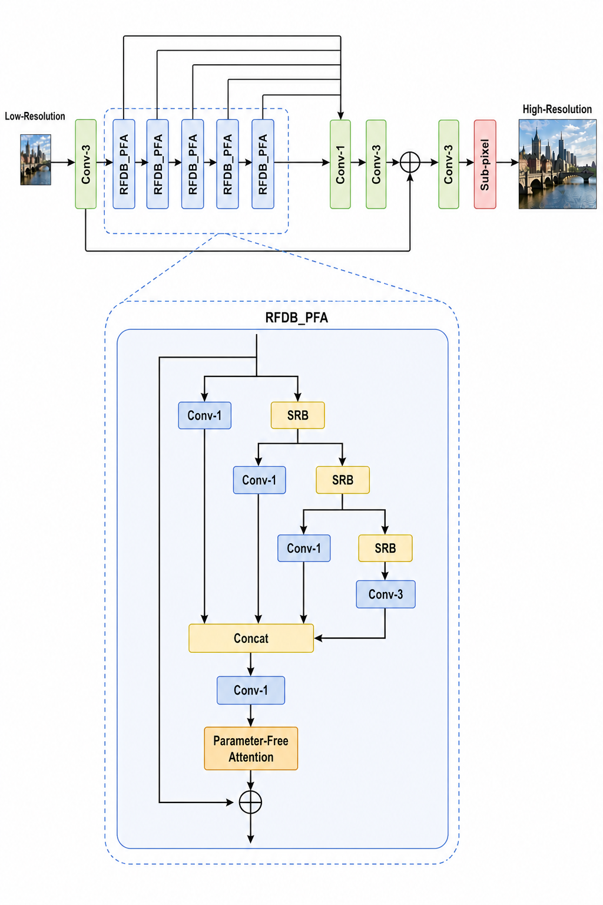

# NTIRE 2026 Efficient Super-Resolution Challenge

This repository contains the implementation and resources for our proposed **RFDN SPAN** model, an efficient super-resolution architecture built upon the RFDN backbone.

## Abstract

RFDN SPAN redesigns the residual feature distillation block (RFDB) by replacing the original ESA module with a parameter-free attention mechanism inspired by SPAN. This attention computes spatial importance directly from intermediate features, enabling effective feature modulation without adding extra parameters. The result is a lightweight model with reduced parameter count and FLOPs while preserving competitive reconstruction quality.

## Highlights

- Efficient model design based on **RFDN**
- Parameter-free spatial attention adapted from **SPAN**
- Reduced computational overhead and parameter count
- Competitive image reconstruction performance

## Challenge Result

Our team **IN2Gm** (Matin Fazel and Dr. Abdelhak Bentaleb) qualified for **The Eleventh NTIRE 2026 Efficient Super-Resolution Challenge** and achieved **7th place**.

## Report

Full report available at: [https://arxiv.org/pdf/2604.03198v1](https://arxiv.org/pdf/2604.03198v1)

## Repository Structure

- `models/` – model definitions for the proposed architectures
- `model_zoo/` – pretrained weights
- `utils/` – helper scripts for image processing, logging, and model inspection
- `test_demo.py` – demo entrypoint for evaluation and testing
- `run.sh` – example script for running experiments

